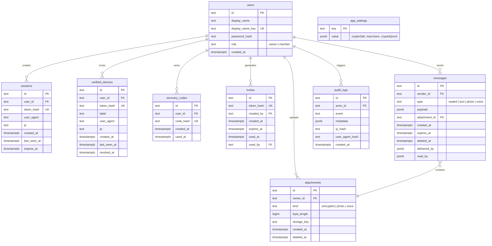

# Chat With Me - Comprehensive Project Analysis Report

This report presents a thorough structural, architectural, and security analysis of **Chat With Me**, a private, invite-only, end-to-end encrypted (E2EE) chat website built for two people.

---

## 1. Project Overview & Scope

**Chat With Me** is a highly secure, private communication application designed for two individuals. The architecture guarantees zero-knowledge storage of chat content and attachments by performing all cryptographic functions entirely on the client side (browser). 

### Key Features Summary
*   **True Zero-Knowledge Encryption**: Root keys are derived on the browser using a strong private phrase. The phrase and root keys are never sent to the server.
*   **Real-Time Communications**: Sub-second message delivery via Socket.io channels with user typing presence indicator.
*   **Dual Storage Drivers**: Support for local file-based JSON storage (for development/lite setups) and high-performance PostgreSQL (for production).
*   **Hybrid Media Storage**: Media attachments can be stored locally on the disk or streamed to S3-compatible cloud object storage (e.g., Cloudflare R2).
*   **Security & Session Hardening**: Strict CSP, active session & device management, security audit log, memory-hard Argon2id password hashing, and auto-disappearing messages.

---

## 2. Component Architecture

The codebase has a clean separation of concerns, divided into modular backend store controllers, client-side files, and supporting utility scripts.

```mermaid
graph TD
    subgraph Client (Browser)
        Index[public/index.html]
        Styles[public/styles.css]
        App[public/app.js]
        SW[public/sw.js]
        Subtle[Web Cryptography API]
    end

    subgraph Server (NodeJS)
        ServerJS[src/server.js]
        Envelope[src/envelope.js]
        Security[src/security.js]
        Media[src/media-storage.js]
        
        subgraph Data Stores
            JsonStore[src/store.js]
            PgStore[src/postgres-store.js]
        end
    end

    subgraph Storage Targets
        LocalDisk[(Local File System)]
        Postgres[(PostgreSQL Database)]
        S3Bucket[(S3 / Cloudflare R2)]
    end

    App -->|HTTP / WebSockets| ServerJS
    App -->|Local Encryption| Subtle
    ServerJS --> Envelope
    ServerJS --> Security
    ServerJS --> Media
    ServerJS --> JsonStore
    ServerJS --> PgStore
    
    Media --> LocalDisk
    Media --> S3Bucket
    JsonStore --> LocalDisk
    PgStore --> Postgres
```

### File Hierarchy & Directory Analysis

| Directory / File | Description | Technologies / Drivers |
| :--- | :--- | :--- |
| **`public/`** | Frontend client-facing files. Zero external framework dependencies. | HTML5, Vanilla ES6 JS, Socket.io-client, CSS Variables |
| ├─ [index.html](file:///C:/Users/Arjun/Desktop/CHAT%20WITH%20ME/public/index.html) | Main HTML layout structuring forms, chat view, dialog modals. | Semantic HTML5 |
| ├─ [styles.css](file:///C:/Users/Arjun/Desktop/CHAT%20WITH%20ME/public/styles.css) | Premium custom design system with support for dark/light grids. | Flexbox, Grid, CSS variables, transitions |
| ├─ [app.js](file:///C:/Users/Arjun/Desktop/CHAT%20WITH%20ME/public/app.js) | Core client logic, UI rendering, real-time events, Web Cryptography. | PBKDF2, HKDF, AES-GCM 256-bit, AudioRecorder API |
| ├─ [sw.js](file:///C:/Users/Arjun/Desktop/CHAT%20WITH%20ME/public/sw.js) | Service Worker for handling basic PWA caching & offline behaviors. | Cache API |
| **`src/`** | Backend server runtime modules. | Node.js (>=24.7), Express 5, Socket.io |
| ├─ [server.js](file:///C:/Users/Arjun/Desktop/CHAT%20WITH%20ME/src/server.js) | Entrypoint server config, rate limiters, HTTP endpoints, WebSocket channels. | Helmet, Compression, Express, Socket.io |
| ├─ [envelope.js](file:///C:/Users/Arjun/Desktop/CHAT%20WITH%20ME/src/envelope.js) | Data validation layer for incoming encryption envelopes. | JSON schema assertion |
| ├─ [store.js](file:///C:/Users/Arjun/Desktop/CHAT%20WITH%20ME/src/store.js) | Local file-based development database store with write serialization. | FS Promises, JSON storage |
| ├─ [postgres-store.js](file:///C:/Users/Arjun/Desktop/CHAT%20WITH%20ME/src/postgres-store.js) | PostgreSQL production store using advisory locks for transactional integrity. | `pg` Pool, advisory locks |
| ├─ [media-storage.js](file:///C:/Users/Arjun/Desktop/CHAT%20WITH%20ME/src/media-storage.js) | Media controller routing binary uploads between local storage and S3 buckets. | `@aws-sdk/client-s3` |
| ├─ [security.js](file:///C:/Users/Arjun/Desktop/CHAT%20WITH%20ME/src/security.js) | Server security helper providing password verification, hashing & audit logs. | `crypto.argon2` (Node Native), `bcryptjs` |
| **`scripts/`** | Administration, migration, and management utilities. | Node.js scripting |
| ├─ `backup.js` / `restore.js` | Encrypted data backup & restore scripts using custom passphrases. | AES-256-CBC |
| └─ `migrate-*.js` | Data migrators to move JSON structures to PostgreSQL and files to S3. | Postgres/S3 drivers |
| **`test/`** | Continuous integration automated test suite. | Node test runner |
| ├─ `encryption-envelope.test.js`| Validates envelope format, rejecting invalid formats or dates. | `node:test` |
| └─ `message-lifecycle.test.js` | Evaluates E2EE flow, legacy compatibility, read/deleted updates, and expiry. | `node:test`, mock Store |

---

## 3. Deep-Dive Cryptography & Zero-Knowledge Architecture

The security architecture of **Chat With Me** relies entirely on client-side encryption, using the standard browser Web Cryptography API. The server only stores, transfers, and purges **sealed, opaque ciphertexts** without ever obtaining raw text, images, or audio data.

```
       [ Client A ]                                   [ Server ]                              [ Client B ]
            |                                             |                                        |
 1. Enter phrase "my secret phrase"                       |                                        |
 2. KDF: PBKDF2-SHA256 (250k iterations)                  |                                        |
 3. Root Key derived                                      |                                        |
 4. Derive Epoch Key: HKDF-SHA256 (Epoch 1)               |                                        |
            |                                             |                                        |
 5. Send message:                                         |                                        |
    Encrypt "Hello!" -> AES-GCM-256                       |                                        |
    Envelope { v: 1, alg: "AES-GCM",                      |                                        |
               epoch: 1, iv, ciphertext }                 |                                        |
            |-------------( message:send )--------------->|                                        |
            |                                             |-- (stores sealed JSON row)             |
            |                                             |-- (broadcasts message:new)             |
            |                                             |--------------------------------------->|
            |                                             |                                        | 6. KDF: PBKDF2-SHA256 (on login)
            |                                             |                                        | 7. Root Key derived
            |                                             |                                        | 8. Get Epoch Key: HKDF (Epoch 1)
            |                                             |                                        | 9. Decrypt AES-GCM Envelope
            |                                             |                                        |    -> "Hello!"
```

### 3.1 Client-Side Key Derivation (KDF)
1.  **Shared Phrase Input**: When unlocking the chat room, the user provides a private encryption phrase.
2.  **PBKDF2 Hashing**: The browser derives a **256-bit Root Secret** from the phrase and a server-supplied unique `cryptoSalt` via **PBKDF2-HMAC-SHA-256** using **250,000 iterations**.
3.  **HKDF Subkey Derivation**: Rather than using the root key directly for encryption, the client derives epoch-specific keys using **HKDF-SHA-256**. The HKDF parameters include the original `cryptoSalt` as the HKDF salt, and standard domain separation info containing the numeric epoch:
    ```javascript
    info = new TextEncoder().encode(`chat-with-me session epoch ${epoch}`)
    ```
4.  **Key Fingerprint Generation**: To prevent Man-in-the-Middle (MitM) compromises, a sha256 hash is taken of the derived root secret combined with a unique prefix:
    ```javascript
    context = encoder.encode('chat-with-me key fingerprint v1');
    digest = sha256(concat(context, rootBytes));
    ```
    This is displayed in the UI as a 16-byte hex fingerprint (formatted in groups of 4 characters) so that the two users can verify their derived secrets out-of-band.

### 3.2 Numeric Session Epochs (Key Rotation)
To offer a lightweight forward-secrecy mechanism, the application tracks a numeric `sessionEpoch` in the system settings:
*   Every time a **new login session** is authorized, the server increments the `sessionEpoch` and broadcasts it to online clients.
*   New messages are encrypted using the derived key for the **latest epoch**.
*   The message data includes an `epoch` indicator in the envelope, allowing clients to derive the matching historical epoch subkey using HKDF-SHA-256 and decrypt older messages seamlessly.
*   This protects historical sessions if keys are compromised in a temporary memory disclosure event, and separates cryptographical materials across session boundaries.

### 3.3 Message and Media Envelopes
Both messages and media are stored as **AES-GCM (256-bit)** envelopes. An envelope strictly complies with this structure:
```json
{
  "v": 1,
  "alg": "AES-GCM",
  "epoch": 2,
  "iv": "B64URL_IV_BYTES...",
  "ciphertext": "B64URL_CIPHERTEXT..."
}
```

*   **Metadata Hiding**: The server has no knowledge of message types. The message record on the server is stored as a generic `type: 'sealed'`. The actual message kind (`kind: 'text' | 'photo' | 'voice'`) is sealed inside the encrypted payload.
*   **Media Attachments**: Photos and voice recordings are compressed on the client, encrypted using an AES-GCM envelope, and sent to the `/api/attachments` endpoint. The server saves the encrypted file on the disk or S3 without accessing the raw content, returning a random `attachmentId`. The client then encrypts the `attachmentId` inside the main message payload, ensuring complete data security.

---

## 4. Database Schema Analysis

The database model is mapped consistently across the **JSON Store** and **PostgreSQL**. The PostgreSQL schema structure features indexes, cascading foreign keys, and strict data type constraints.



---

## 5. Design & User Interface System

The frontend is styled using modern, lightweight Vanilla CSS. The interface is optimized to feel responsive, vibrant, and premium:

*   **Harmonious Color Palette**: Built on HSL tailored colors (`--bg: #f7f8fa`, `--ink: #22252a`, and a primary warm accent `--accent: #f35f4c`).
*   **Aesthetics & Micro-Animations**: Features visual elements like glassmorphic blur in header backdrops (`backdrop-filter: blur(12px)`), fluid transitions on interaction states, and unique message bubbles using separate color systems (`--mine: #fff1ef`, `--theirs: #eef6f4`).
*   **Media Optimization**: Incorporates image pre-compression (rescaling large uploads to standard sizing up to 1600px and compressing to 84% jpeg quality) to ensure fast loading times and reduced database footprint.
*   **Mobile-First Responsive Layout**: Elements scale beautifully. Flex and grid styling structures are responsive, while a media query breakpoint shifts composer text inputs, expiry buttons, and attachment buttons to an optimized mobile block format below 760px.

---

## 6. Verification & Test Suite Results

The project features a suite of tests that cover data formats and the encryption pipeline. The tests are executed using the built-in Node test runner:

### Test Suite Execution Output
All 6 automated tests pass successfully:

```
✔ accepts encrypted envelopes with numeric session epochs (2.16ms)
✔ validates sealed message input without exposing message type (7.97ms)
✔ rejects attachment envelopes with date-string epochs (1.71ms)
✔ stores sealed messages and runs delivery/read/delete lifecycle (38.37ms)
✔ legacy messages keep encrypted payload compatibility without public type leakage (11.66ms)
✔ purges expired sealed messages and linked attachments (15.44ms)

ℹ tests 6
ℹ suites 0
ℹ pass 6
ℹ fail 0
ℹ cancelled 0
ℹ skipped 0
ℹ todo 0
ℹ duration_ms 308.39
```

Additionally, syntax validity checks (`npm run check`) successfully verified the syntax of all server, client, and helper files:
*   `src/server.js`, `src/store.js`, `src/postgres-store.js`
*   `src/media-storage.js`, `src/security.js`, `src/envelope.js`
*   `scripts/backup.js`, `scripts/restore.js`, `scripts/migrate-json-to-postgres.js`, `scripts/migrate-media-to-s3.js`
*   `public/app.js`, `public/sw.js`

---

## 7. Recommendations & Security Guidelines For Production Launch

Before opening the application to the internet, several critical administrative steps must be completed to ensure proper security boundaries:

1.  **Configure Strict Environment Credentials**:
    Ensure the production environment has secure environment variables set. Make sure to generate strong random values for:
    *   `APP_SETUP_CODE`: A highly complex random setup token used to authorize the creation of the first account.
    *   `BACKUP_PASSPHRASE`: Used by backup scripts to encrypt local dumps before storing or uploading.
    *   `DATABASE_URL`: A dedicated connection string to a production PostgreSQL database.
2.  **Enable S3/Cloudflare R2 Media Storage**:
    Configure `MEDIA_DRIVER=s3` combined with S3 API endpoints (`S3_BUCKET`, `S3_ACCESS_KEY_ID`, `S3_SECRET_ACCESS_KEY`, etc.) pointing to a private Cloudflare R2 bucket. Ensure the R2 API key permissions are restricted exclusively to the target bucket.
3.  **Strict Transport Security (HTTPS)**:
    Ensure production traffic is served strictly over HTTPS. Caddy is already structured to automate Let's Encrypt certificates if self-hosting via Docker Compose.
4.  **Audit Logs & CSP Monitoring**:
    Provide a `CSP_REPORT_URI` environment variable pointing to `/api/csp-report` to record blocked external scripts or styles. This will allow the owner to easily identify and troubleshoot security issues.
